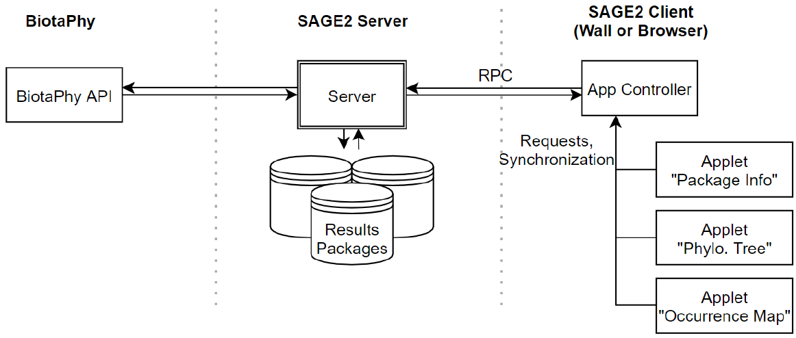
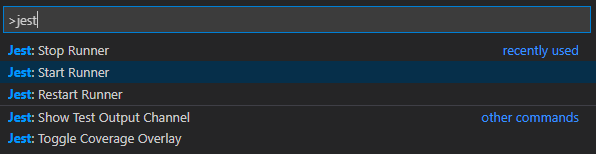
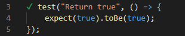

# BiotaPhy SAGE2 App
[](https://travis-ci.org/mielliott/biotaphy-sage2)
[](https://codecov.io/gh/mielliott/biotaphy-sage2)

## Overview



## Start developing
```bash
cd $SAGE2_HOME/public/uploads/apps
git clone git@github.com:mielliott/biotaphy-sage2.git
npm install
```

### Compile
```bash
./bundle.sh
```
To automatically build the app while making changes to the source code,
```bash
./watch.sh
```

## Set up tests
To enable testing in Visual Code,
1. Install `jest` globally
```bash
npm install -g jest
```
2. Install the `jest` plugin in vscode
3. Press CTRL-Shift-P to open the command console, then find "Jest: Start Runner"



4. If there are green checks next to your test functions, all is well


